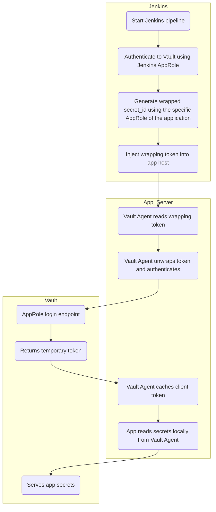
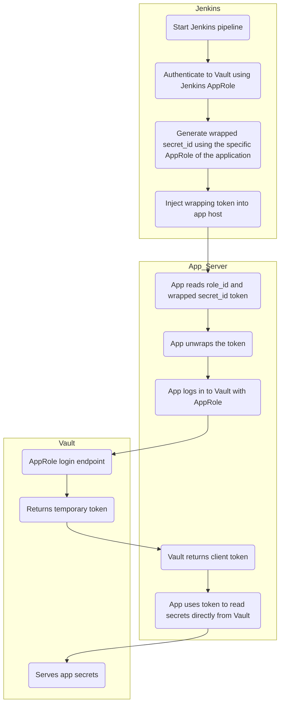

# Flujo de Jenkins, Vault y App con AppRole

## bash script
```bash
# Loading policies
vault write policy jenkins-policy jenkins-policy.hcl
vault policy write app-policy app-policy.hcl

# Enabling AppRole auth
vault auth enable approle

# Creating roles
vault write auth/approle/role/jenkins policies=jenkins-policy.hcl
vault write auth/approle/role/app1 policies=app-policy.hcl

## Flow 1 y 2: Jenkins flow

    ### 1. Jenkins obtiene su token usando su propio AppRole (Jenkins-role)
    vault write auth/approle/login \
        role_id=<jenkins-role-id> \
        secret_id=<jenkins-secret-id>

    ### 2. Create the secret id wrapped
    vault write -f -wrap-ttl=5m auth/approle/role/app1/secret-id

    ### 3. Inject the info to the app

## Flow 1 app side
    # 1. Start vault agent with the vault agent file configuration
    vault agent -config=./VaultAgentFile.hcl

    # 2. The app can read secrets through the agent socket
    curl --header "X-Vault-Token: $(cat /etc/vault/token)" http://127.0.0.1:8200/v1/secret/data/myapp


## Flow 2 app side
    # 1. The app receives a wrapped token)

    # 2. Unwrap token
    export VAULT_TOKEN=s.wrapXyZabc123 
    vault unwrap -field=secret_id

    # 3. Login with role_id and secret_id
    vault write auth/approle/login \
        role_id=<role_id> \
        secret_id=<secret_id>
```




## Flow 2: Without Vault Agent on the app

